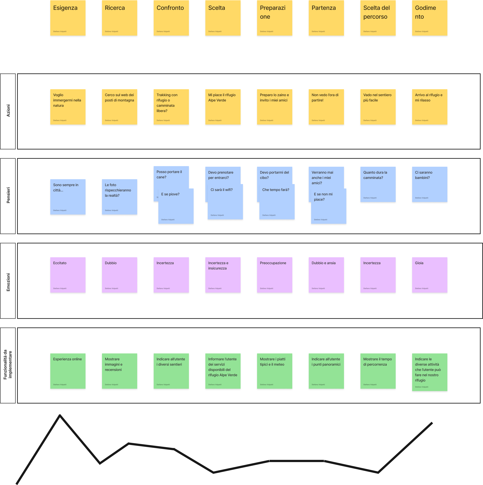

# Simulazione Esame 14/07/2022

## Indice

0. Introduzione

1. Approccio Progettuale

   A: l'utente target

   B: i bisogni informativi e funzionali

   C: Idee emerse

2. Wireframe

3. Codice e tecnologie

### 0 Introduzione

Il progetto è finalizzato alle realizzazione di un sito web dove gli utenti possono scegliere e prenotare la loro prossima avventura ad alta quota.
Comprenderà una fase di ricerca attraverso le **personas** con l'ausilio di una **Customer Journey Map** passando per la realizzazione del **WireFrame** fino allo **sviluppo** di un applicativo.

### 1 Approccio Progettuale

#### 1 - A

L'utente target in questione sono potenzialmente persone comprese dai 17 ai 65 anni.
Queste persone hanno in comune la passione per la montagna e tutti gli sport che ne derivano come ad esempio il trakking e le escursioni.
Sono professionisti, imprenditori e studenti che nel loro tempo libero hanno il bisogno ed il piacere di immergersi nella natura staccandosi totalmente dalla vita lavorativa.
Presentano diverse competenze in ambito informatico a seconda dell'età ma con una conoscenza di base in comune.

**_Di seguito le personas:_**

#### Arianna


#### Fausto


<hr>

#### 1 - B

È fondamentale che l'utente venga accolto calorosamente in ogni nostro rifugio di competenza.
Nel momento in cui raggiungerà la nostra meta sarà potenzialmente stanco e affamato e dovrà essere accolto con un piatto caldo e un posto letto se in notturna.
Avrà la possibilità di rilassarsi in un contesto pulito e tranquillo attraverso escursioni guidate nei pressi del rifugio.

**_Di seguito la Customer Journey Map:_**



<hr>

#### 1 - C

La struttura del sito web dovrà far emergere all'utente una sensazione di piacere e di facilità durante la navigazione.
Le informazioni dovranno essere chiare e precise ma sopratutto individuabili senza nessuna difficoltà e di conseguenza accessibili anche per coloro che presentano deficit cognitivi.
Sarà presente una barra di navigazione con le seguenti voci:

<ul>
<li>Home</li>
<li>Chi Siamo</li>
<li>Contattaci</li>
</ul>

I rifugi verranno mostrati sulla Home attraverso delle card che mostreranno le informazioni essenziali per offrire all'utente una panoramica generale e lo stato di ogni rifugio.

Le card mostreranno le seguenti informazioni:

<ul>
<li>Foto rifugio</li>
<li>Aperto o chiuso</li>
<li>Tipo di menù</li>
<li>Numero di sentieri</li>
</ul>

Ogni card avrà un buttone che porterà l'utente ad una pagina di dettaglio del rifugio; in questa maniera l'utente avrà a disposizione tutte le informazioni riguardanti quel specifico rifugio.
La pagina di dettaglio presenterà la medesima barra di navigazione e sotto di essa ci sarà un **Header** comprendente di:

<ul>
<li>Nome del rifugio</li>
<li>Immagine del rifugio</li>
<li>Orario di apertura</li>
<li>Meteo</li>
</ul>

<hr>

First, run the development server:

```bash
npm run dev
# or
yarn dev
```

Open [http://localhost:3000](http://localhost:3000) with your browser to see the result.

You can start editing the page by modifying `pages/index.js`. The page auto-updates as you edit the file.

[API routes](https://nextjs.org/docs/api-routes/introduction) can be accessed
on [http://localhost:3000/api/hello](http://localhost:3000/api/hello). This endpoint can be edited
in `pages/api/hello.js`.

The `pages/api` directory is mapped to `/api/*`. Files in this directory are treated
as [API routes](https://nextjs.org/docs/api-routes/introduction) instead of React pages.

## Learn More

To learn more about Next.js, take a look at the following resources:

- [Next.js Documentation](https://nextjs.org/docs) - learn about Next.js features and API.
- [Learn Next.js](https://nextjs.org/learn) - an interactive Next.js tutorial.

You can check out [the Next.js GitHub repository](https://github.com/vercel/next.js/) - your feedback and contributions
are welcome!

## Deploy on Vercel

The easiest way to deploy your Next.js app is to use
the [Vercel Platform](https://vercel.com/new?utm_medium=default-template&filter=next.js&utm_source=create-next-app&utm_campaign=create-next-app-readme)
from the creators of Next.js.

Check out our [Next.js deployment documentation](https://nextjs.org/docs/deployment) for more details.
