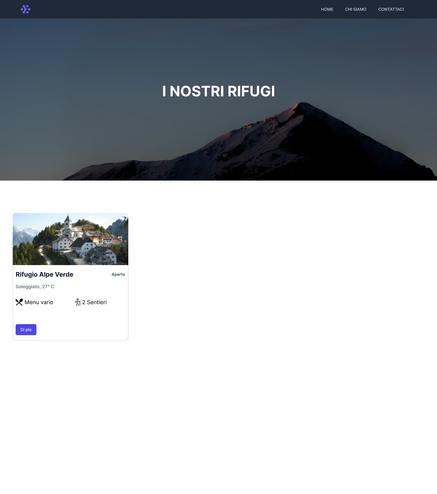

# Simulazione Esame 14/07/2022

## Indice

[0. Introduzione](#0-introduzione)

1. Approccio Progettuale

   [A: l'utente target](#1---a)

   [B: i bisogni informativi e funzionali](#1---b)

   [C: struttura dell'eventuale sito](#1---c)

   [D: Idee emerse](#1---d)

[2. Wireframe](#2-wireframe)

[3. Codice e tecnologie](#3-codice-e-tecnologie)

### 0 Introduzione

Il progetto è finalizzato alle realizzazione di un sito web dove gli utenti possono scegliere e prenotare la loro prossima avventura ad alta quota.
Comprenderà una fase di ricerca attraverso le **personas** con l'ausilio di una **Customer Journey Map** passando per la realizzazione del **WireFrame** fino allo **sviluppo** di un applicativo.

### 1 Approccio Progettuale

#### 1 - A

L'utente target in questione sono potenzialmente persone comprese dai 17 ai 65 anni.
Queste persone hanno in comune la passione per la montagna e tutti gli sport che ne derivano come ad esempio il trakking e le escursioni.
Sono professionisti, imprenditori e studenti che nel loro tempo libero hanno il bisogno ed il piacere di immergersi nella natura staccandosi totalmente dalla vita lavorativa.
Presentano diverse competenze in ambito informatico a seconda dell'età ma con una conoscenza di base in comune.

[Per visualizzare su Figma](https://www.figma.com/file/5CPFk51ThRnYMjCwePYByA/Simulazione-Esane-14%2F06?node-id=46%3A9123)

**_Di seguito le personas:_**

#### Arianna

#### Fausto

#### 1 - B

È fondamentale che l'utente venga accolto calorosamente in ogni nostro rifugio di competenza.
Nel momento in cui raggiungerà la nostra meta sarà potenzialmente stanco e affamato e dovrà essere accolto con un piatto caldo e un posto letto se in notturna.
Avrà la possibilità di rilassarsi in un contesto pulito e tranquillo attraverso escursioni guidate nei pressi del rifugio.

**_Di seguito la Customer Journey Map:_**

#### 1 - C

La struttura del sito web dovrà far emergere all'utente una sensazione di piacere e di facilità durante la navigazione.
Le informazioni dovranno essere chiare e precise ma sopratutto individuabili senza nessuna difficoltà e di conseguenza accessibili anche per coloro che presentano deficit cognitivi.
Sarà presente una barra di navigazione con le seguenti voci:

<ul>
<li>Home</li>
<li>Chi Siamo</li>
<li>Contattaci</li>
</ul>

I rifugi verranno mostrati sulla Home attraverso delle card che mostreranno le informazioni essenziali per offrire all'utente una panoramica generale e lo stato di ogni rifugio.

Le card mostreranno le seguenti informazioni:

<ul>
<li>Foto rifugio</li>
<li>Aperto o chiuso</li>
<li>Tipo di menù</li>
<li>Numero di sentieri</li>
</ul>

Ogni card avrà un buttone che porterà l'utente ad una pagina di dettaglio del rifugio; in questa maniera l'utente avrà a disposizione tutte le informazioni riguardanti quel specifico rifugio.
La pagina di dettaglio presenterà la medesima barra di navigazione e sotto di essa ci sarà un **Header** comprendente di:

<ul>
<li>Nome del rifugio</li>
<li>Immagine del rifugio</li>
<li>Orario di apertura</li>
<li>Meteo</li>
</ul>

#### 1 - D

Le idee che sono emerse riguardano la disposizione degli elementi nelle diverse pagine.
A mio parere personale il design per questo sito deve essere per lo più funzionale in quanto l'utente....

### 2 Wireframe

[Per visualizzare il wireframe su Figma](https://www.figma.com/file/5CPFk51ThRnYMjCwePYByA/Simulazione-Esane-14%2F06?node-id=3%3A123)

**_Di seguito la pagina Home:_**

 

**_Di seguito la pagina Dettaglio:_**

### 3 Codice e tecnologie

Ho utilizzato Next.js (un framework JavaScript basato su React) in quanto mi ha permesso di sviluppare il sito in maniera rapida e efficente.
Ho utilizzato inoltre JSON-Server con il quale attraverso l'uso di API ho potuto servire il mio Front-End.

## Per avvio dell'applicazione:

#### Installazione Ambiente

      yarn install

#### Run

      yarn dev

## Per avvio del server:

Clonare la seguente repo: [Server](https://github.com/volp99/json-server)

#### Installazione Ambiente

      yarn install

#### Run server

      yarn server
